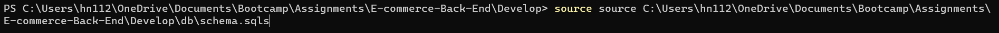
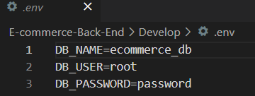
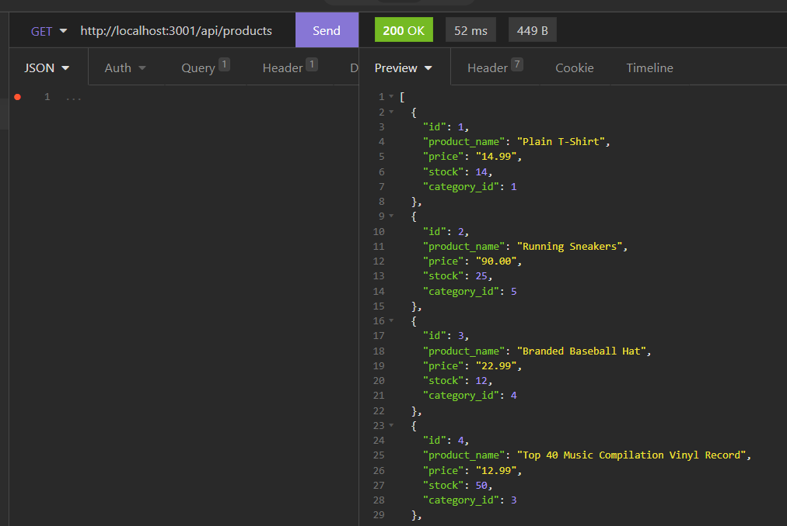

# E-commerce Back-End
 
<div id="top"></div>

<br />
<div align="center">


<h3 align="center">E-commerce Back-End</h3>

  <p align="center">
    SQL-based, E-commerce database
    <br />
  </p>
</div>

<details>
  <summary>Table of Contents</summary>
  <ol>
    <li><a href="#about-the-project">About The Project</a></li>
    <li><a href="#tools">Tools</a></li>
    <li><a href="#instructions">Instructions</a></li>
    <li><a href="#usage">Usage</a></li>
    <li><a href="#license">License</a></li>
    <li><a href="#contact">Contact</a></li>
  </ol>
</details>

## About The Project

The motivation behind this project is to create an SQL-based E-commerce application back-end. 

The SQL-based applicaton allows users to initiate a database for tracking E-commerce resources including products, prices and inventory. Once the database is initiated, users are able to view, add, modify and delete items from the database using API routes.

<p align="right">(<a href="#top">back to top</a>)</p>

### Tools

* JavaScript
* SQL
* Node.js


<p align="right">(<a href="#top">back to top</a>)</p>

## Instructions

Please follow the instructions below to install and use the E-commerce database: 

- You will need to download the repository files to your local machine. 
- Type the two following commands into the command prompt within the root directory of the repository to download the npm module:
```
npm init -y 
```
```
npm install
``` 
- This application requires MySQL. You will need to run the schema.sql file using MySQL to create the E-commerce database. The seeds.sql file is used to prepopulate your database and is optional. You can download MySQL <a href = 'https://dev.mysql.com/downloads/installer/'> here </a>. Once you have MySQL installed, run the following command lines within the root directory of your repository to create the employees database.
```
mysql -u root -p
```
```
<Enter your password>
```
```
source <enter the directory of your schema.sql file>
```




```
quit
```
```
optional: npm run seed
```

- Within an .env file, you will need to update your MySQL password to the password you set when you installed MySQL.



<br>

- Type the following into the command prompt to run the E-commerce back-end.
```
npm start
```
- Once you have initiated the applicaiton, your SQL-based database will be active on your local server which can then be updated using API post, put or delete routes. 


## Usage

Refer to video linked below for a working demonstration of the application:

[](https://drive.google.com/file/d/1-t3laJLcOOlQO3-MtEeHgO_wfEuc-UJ9/view?usp=sharing)


<p align="right">(<a href="#top">back to top</a>)</p>

## License

[](https://opensource.org/licenses/MIT)
<br>Distributed under the MIT License. See `LICENSE.txt` for more information.

<p align="right">(<a href="#top">back to top</a>)</p>

## Contact

Henry Nguyen -  hln11244@gmail.com

Repository Link: [https://github.com/henry11244/E-commerce-Back-End](https://github.com/henry11244/E-commerce-Back-End)

linkedIn: https://www.linkedin.com/in/henry11244/

<p align="right">(<a href="#top">back to top</a>)</p>


